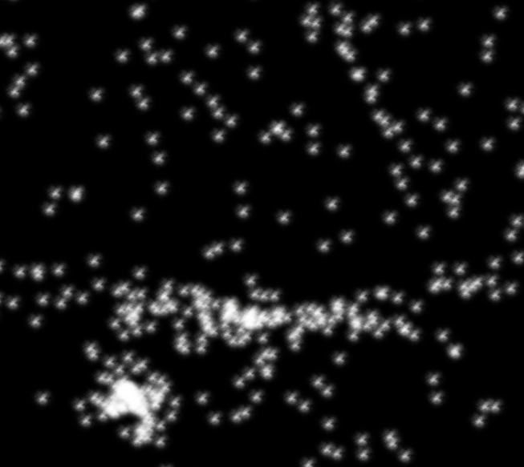

##*Generic Programming on GPU*

-----
**CMake Build instructions**

-----
  - Out-of-source build :
 ```
git clone git@github.com:Modelisation5ETI/TP2_GPGPU.git && \
mkdir TP2_GPGPU-build && cd TP2_GPGPU-build  && \
cmake ../TP2_GPGPU  && \
make -j
 
 ```
  - QtCreator :
 ```
git clone git@github.com:Modelisation5ETI/TP2_GPGPU.git  && \
mkdir TP2_GPGPU-build && cd TP2_GPGPU-build  && \
qtcreator ../TP2_GPGPU
 
 ```
  *Then configure project using QtCreator API* : 
   - *Set the build directory to TP2_GPGPU-build/*
   - *Run CMake and build project*


-----
**Implementation**

-----

 - ### Transform Feedback
 

 ```
 ./TransformFeedback_
 ```
 
 This program uses Transform Feedback Buffers to animate a particle system.
 
 Use arrows to move the point where particles converge.
 
 - ### Image simple
 
 
 
 
 
 ```
 ./ImageSimple_
 ``` 
 Process image filters on GPU.
 
 Use [0,1,2,3,4] keys to process different filters.
 
 Use arrow UP or DOWN to change the filter parameter.

 - ### Frame Buffer Object
 

 ```
 ./FrameBufferObject_
 ```
 Render a scene into a frame buffer object (FBO) and use its texture to render another scene in the current buffer.
 
 Use arrow LEFT or RIGHT to interact with the 'FBO' scene.
